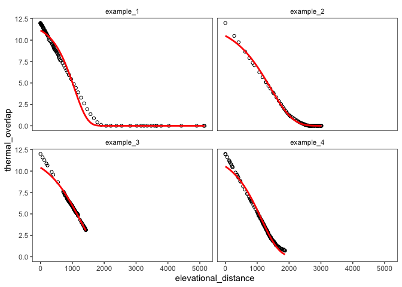

slope\_estimation
================

## Estimating the slope of thermal overlap across transects

To move from our visual / qualitative description of thermal overlap and
elevational distance across mountain ranges, we want to fit an
appropriate nonlinear model to our point estimates for each transect,
extract an estimate of the slope parameter and variance of this model,
and then calculate the variance across slope estimates for different
transects in the same mountain range.

Short of writing our own function, I think a Gompertz curve is most
likely to do a reasonable job descibing these patterns. A Gompertz curve
differs from a logistic curve only in not being symmetric around the
inflection point—something true of most of these data. It is often
applied to models of population growth over time—a lower representing
pre-growth \(N\), an upper bound representing carrying capacity. For our
purposes, we’d think about an upper bound of no thermal overlap and a
lower bound of complete thermal overlap, and elevational distance
instead of time steps.

Here is a four-parameter version of the function:

\[
Y=c+(d-c) \exp \{-\exp [b(X-e)]\}
\]

where \(b\) can be positive or negative and is the slope of the curve;
\(c\) is the lower asymptote; \(d\) is the upper asymptote, and \(e\) is
a value midway between asymptotes. In order to make slope estimates
comparable across transects, we’ll want to fix \(c=0\) and \(d=12\).

Let’s apply the function to a handful of transects and see how well it
works with these data. First, let’s extract a few individual transects
from different mountain ranges showing different relationships:

``` r
# load libraries
library(tidyverse)
```

    ## ── Attaching packages ───────────────────────────────────────────── tidyverse 1.3.0 ──

    ## ✓ ggplot2 3.3.2     ✓ purrr   0.3.4
    ## ✓ tibble  3.0.3     ✓ dplyr   1.0.2
    ## ✓ tidyr   1.1.2     ✓ stringr 1.4.0
    ## ✓ readr   1.3.1     ✓ forcats 0.5.0

    ## ── Conflicts ──────────────────────────────────────────────── tidyverse_conflicts() ──
    ## x dplyr::filter() masks stats::filter()
    ## x dplyr::lag()    masks stats::lag()

``` r
library(drc)
```

    ## Loading required package: MASS

    ## 
    ## Attaching package: 'MASS'

    ## The following object is masked from 'package:dplyr':
    ## 
    ##     select

    ## 
    ## 'drc' has been loaded.

    ## Please cite R and 'drc' if used for a publication,

    ## for references type 'citation()' and 'citation('drc')'.

    ## 
    ## Attaching package: 'drc'

    ## The following objects are masked from 'package:stats':
    ## 
    ##     gaussian, getInitial

``` r
# load transect data
load("/Users/ethanlinck/Dropbox/mountain_bird_diversification/ignore/mount_transects_toverlap.rda")

# select 1st column of 1st transect of 1st mountain range, grab overlap and elev dist
to_1 <- to[[1]][[1]][,1] %>% as.vector() %>% sort(decreasing = TRUE)
ed_1 <- ed[[1]][[1]] %>% as.matrix()
ed_1 <- ed_1[,1] %>% as.vector() %>% sort()
tran1 <- cbind.data.frame(to_1, ed_1)
tran1$transect <- "example_1"
colnames(tran1) <- c("thermal_overlap","elevational_distance","transect_ID")

# repeat for 1st transect of 15th mountain range
to_2 <- to[[15]][[1]][,1] %>% as.vector() %>% sort(decreasing = TRUE)
ed_2 <- ed[[15]][[1]] %>% as.matrix()
ed_2 <- ed_2[,1] %>% as.vector() %>% sort()
tran2 <- cbind.data.frame(to_2, ed_2)
tran2$transect <- "example_2"
colnames(tran2) <- c("thermal_overlap","elevational_distance","transect_ID")

# repeat for 10th transect of 40th mountain range
to_3 <- to[[40]][[10]][,1] %>% as.vector() %>% sort(decreasing = TRUE)
ed_3 <- ed[[40]][[10]] %>% as.matrix()
ed_3 <- ed_3[,1] %>% as.vector() %>% sort()
tran3 <- cbind.data.frame(to_3, ed_3)
tran3$transect <- "example_3"
colnames(tran3) <- c("thermal_overlap","elevational_distance","transect_ID")

# repeat for 1st transect of 45th mountain range
to_4 <- to[[45]][[1]][,1] %>% as.vector() %>% sort(decreasing = TRUE)
ed_4 <- ed[[45]][[1]] %>% as.matrix()
ed_4 <- ed_4[,1] %>% as.vector() %>% sort()
tran4 <- cbind.data.frame(to_4, ed_4)
tran4$transect <- "example_4"
colnames(tran4) <- c("thermal_overlap","elevational_distance","transect_ID")

# create facet-ready dataframe
example_df <- rbind.data.frame(tran1,tran2,tran3,tran4)
```

Now, let’s visualize theme, using the Gompertz curve self starter from
`drm` package and fixing parameters as described above:

    ## `geom_smooth()` using formula 'y ~ x'

<!-- -->

Not bad, but the effective lack of an upper asymptote in these examples
screws with the fit a bit. Here are the summaries of these fits:

``` r
# run model with four parameter gompertz function
model1 <- drm(thermal_overlap ~ elevational_distance, fct = G.4(fixed=c(b=NA,c=0,d=12,e=NA)), data = tran1)
summary(model1)
```

    ## 
    ## Model fitted: Gompertz (2 parms)
    ## 
    ## Parameter estimates:
    ## 
    ##                 Estimate Std. Error t-value   p-value    
    ## b:(Intercept) 2.4440e-03 5.1885e-05  47.105 < 2.2e-16 ***
    ## e:(Intercept) 1.0605e+03 1.5094e+01  70.261 < 2.2e-16 ***
    ## ---
    ## Signif. codes:  0 '***' 0.001 '**' 0.01 '*' 0.05 '.' 0.1 ' ' 1
    ## 
    ## Residual standard error:
    ## 
    ##  0.5572038 (119 degrees of freedom)

``` r
model2 <- drm(thermal_overlap ~ elevational_distance, fct = G.4(fixed=c(b=NA,c=0,d=12,e=NA)), data = tran2)
summary(model2)
```

    ## 
    ## Model fitted: Gompertz (2 parms)
    ## 
    ## Parameter estimates:
    ## 
    ##                 Estimate Std. Error t-value   p-value    
    ## b:(Intercept) 1.4215e-03 5.9519e-06  238.83 < 2.2e-16 ***
    ## e:(Intercept) 1.4188e+03 5.7571e+00  246.44 < 2.2e-16 ***
    ## ---
    ## Signif. codes:  0 '***' 0.001 '**' 0.01 '*' 0.05 '.' 0.1 ' ' 1
    ## 
    ## Residual standard error:
    ## 
    ##  0.153052 (150 degrees of freedom)

``` r
model3 <- drm(thermal_overlap ~ elevational_distance, fct = G.4(fixed=c(b=NA,c=0,d=12,e=NA)), data = tran3)
summary(model3)
```

    ## 
    ## Model fitted: Gompertz (2 parms)
    ## 
    ## Parameter estimates:
    ## 
    ##                 Estimate Std. Error t-value   p-value    
    ## b:(Intercept) 1.5903e-03 2.1174e-05  75.105 < 2.2e-16 ***
    ## e:(Intercept) 1.2271e+03 3.5961e+00 341.220 < 2.2e-16 ***
    ## ---
    ## Signif. codes:  0 '***' 0.001 '**' 0.01 '*' 0.05 '.' 0.1 ' ' 1
    ## 
    ## Residual standard error:
    ## 
    ##  0.26441 (143 degrees of freedom)

``` r
model4 <- drm(thermal_overlap ~ elevational_distance, fct = G.4(fixed=c(b=NA,c=0,d=12,e=NA)), data = tran4)
summary(model4)
```

    ## 
    ## Model fitted: Gompertz (2 parms)
    ## 
    ## Parameter estimates:
    ## 
    ##                 Estimate Std. Error t-value   p-value    
    ## b:(Intercept) 1.8059e-03 2.1131e-05  85.461 < 2.2e-16 ***
    ## e:(Intercept) 1.1323e+03 3.8310e+00 295.559 < 2.2e-16 ***
    ## ---
    ## Signif. codes:  0 '***' 0.001 '**' 0.01 '*' 0.05 '.' 0.1 ' ' 1
    ## 
    ## Residual standard error:
    ## 
    ##  0.3238357 (182 degrees of freedom)

What do we think? It seems like a custom function would be more elegant
/ improve on this a bit, but the math is a bit beyond me without a nudge
in the right direction.
